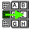
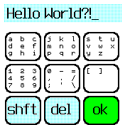
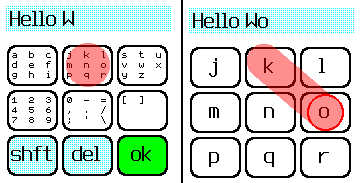

# Drag Keyboard




A gesture based keyboard input utility.

## How to type

Press your finger down on the letter group that contains the character you would like to type, then, without lifting
your finger, slide it over to the letter you want to enter. Once you are touching the letter you want, release your 
finger.



If you pressed down on the screen, and realized you hit the wrong letter group, simply slide your finger above the top
row of buttons to cancel.

Press "shft" to access alternative characters, including upper case letters, punctuation, and special characters.
Pressing "shft" also reveals a cancel button if you would like to terminate input without saving.

Press "ok" to finish typing and send your text to whatever app called this keyboard.

Press "del" to delete the leftmost character.

The "Space" character is in the bottom right corner of the top right letter group, next to "z".

## How to use in a program

This was developed to match the interface implemented for kbtouch, kbswipe, etc.

In your app's metadata, add:

```
  "dependencies": {"textinput":"type"},
```

From inside your app, call:

```
require("textinput").input({text:""}).then(result => {
  console.log("The user entered: ", result);
});
```

The promise resolves when the user hits "ok" on the input or if they cancel. If the user cancels, undefined is 
returned, although the user can hit "OK" with an empty string as well.

The first argument to `input` is an object containing the following:

* `text` - initial text to edit

